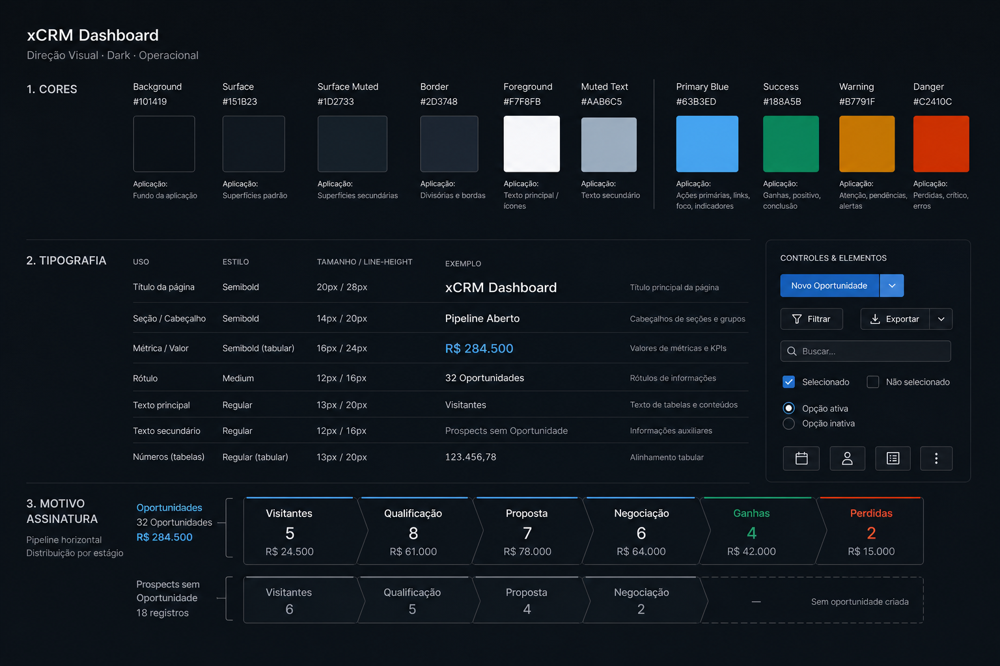
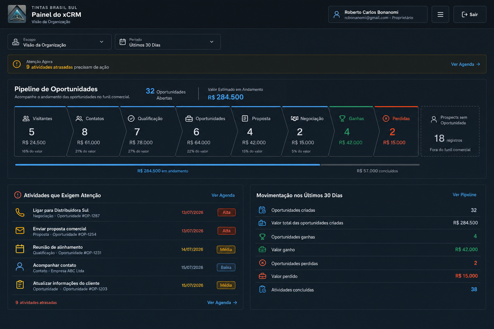

# Plano do Dashboard Principal do xCRM

Criado em: 2026-07-15 19:06:07 -03:00  
Última modificação: 2026-07-15 20:23:09 -03:00

Issue de acompanhamento: `#99 - P1: Redesenhar Dashboard Principal com Pipeline Quantificado`

## 1. Decisão de Produto

O `/dashboard` passa a ser o painel principal exibido após a autenticação. O
Dashboard existente será preservado em `/dashboard-anterior` e permanecerá
acessível pelo menu como `Dashboard Anterior`.

O novo painel não deve tratar a quantidade de etapas configuradas como indicador
de desempenho. Ele separa duas entidades diferentes:

- `Empresa/Prospect`: registro da base comercial, que pode existir sem uma
  oportunidade aberta.
- `Oportunidade`: negociação associada a uma Empresa/Prospect, com etapa, Status,
  Valor Estimado e Previsão de Fechamento.

Essa separação evita chamar todo prospect de oportunidade ou apresentar um valor
de pipeline que não existe nos dados.

## 2. Crítica do Dashboard Anterior

- O bloco `Funil Padrão` mostra configuração estática, sem quantidade ou valor
  por etapa.
- O indicador `Etapas do Funil` mede estrutura, não desempenho comercial.
- Empresas/Prospects, contatos e atividades aparecem repetidos em mais de uma
  região, enfraquecendo a hierarquia.
- Os cards de métricas e de etapas usam altura excessiva; atividades que exigem
  ação ficam abaixo da primeira área visível.
- A mesma composição de borda, fundo e espaçamento é repetida em quase todas as
  seções, reduzindo ritmo e prioridade visual.

Os detectores mecânicos de layout e tipografia não encontraram violações
determinísticas. A revisão visual, porém, identificou problemas de hierarquia,
densidade e semântica que um detector não consegue medir.

## 3. Direção Visual Aprovada

A referência aprovada usa o primeiro mock como composição principal e incorpora
o bloco `Atenção Agora` da segunda proposta.

Princípios:

- Funil horizontal analítico como centro da página.
- Quantidade e Valor Estimado visíveis em cada etapa.
- Prospects sem Oportunidade aberta fora do Pipeline.
- Cor semântica somente para atenção, ganho, perda e seleção.
- Tipografia Geist, números tabulares e escala fixa de produto.
- Sem 3D, gradientes, glassmorphism, cards aninhados ou métricas decorativas.
- Os mocks são referência de hierarquia; números e fotografias são fictícios e
  não devem ser copiados para o produto.

## 4. Escopo e Visibilidade

| Perfil | Escopo do Dashboard |
| --- | --- |
| Proprietário e Administrador | Toda a organização atual |
| Líder | O próprio usuário e membros das equipes que lidera |
| Vendedor e Assistente | Registros sob a própria responsabilidade |

O mesmo escopo deve ser aplicado a Empresas/Prospects, Oportunidades e
Atividades. O tenant sempre permanece como limite obrigatório.

## 5. Definição dos Indicadores

| Indicador | Regra |
| --- | --- |
| Prospects Ativos | Empresas/Prospects com Status `PROSPECT` no escopo visível |
| Prospects sem Oportunidade Aberta | Prospects visíveis sem Oportunidade `OPEN` |
| Oportunidades Abertas | Oportunidades com Status `OPEN` no escopo visível |
| Valor Estimado em Andamento | Soma de `amountEstimated` das Oportunidades abertas |
| Quantidade por Etapa | Oportunidades abertas agrupadas por `stageId` |
| Valor por Etapa | Soma do Valor Estimado das Oportunidades abertas da etapa |
| Ganhas no Período | Oportunidades distintas movidas para etapa `isWon` dentro do período |
| Perdidas no Período | Oportunidades distintas movidas para etapa `isLost` dentro do período |
| Atividades Atrasadas | Atividades `PENDING` com `scheduledAt` anterior ao momento atual |
| Oportunidades sem Data | Oportunidades abertas sem `expectedCloseDate` |
| Oportunidades sem Valor | Oportunidades abertas sem `amountEstimated` |

Valores de ganho e perda continuam sendo estimativas comerciais. O xCRM ainda
não possui campo de receita realizada; a interface deve declarar essa limitação.

## 6. Arquitetura da Tela

1. Cabeçalho autenticado existente, preservando marca, tenant, usuário, menu e
   saída.
2. Faixa de contexto com Escopo e seletor segmentado de 7, 30 ou 90 dias; o
   padrão é 30 dias.
3. `Atenção Agora`, priorizando atividade atrasada, ausência de Previsão de
   Fechamento e ausência de Valor Estimado.
4. `Pipeline de Oportunidades`, com resumo, etapas abertas, ganhos/perdas do
   período e Prospects fora do Pipeline.
5. `Atividades que Exigem Atenção`, limitado às primeiras cinco pendências com
   acesso à Agenda.
6. `Movimentação nos Últimos N Dias`, com novos Prospects, Oportunidades criadas,
   Valor Estimado criado, ganhos, perdas e Atividades concluídas.
7. Nota explícita de que valores são estimativas, não faturamento.

## 7. Estados e Interações

- O período é persistido na URL por `?period=7`, `30` ou `90`.
- Segmentos do Pipeline quebram para novas linhas em telas estreitas e usam
  alvos compatíveis com toque, sem rolagem horizontal.
- Pipeline sem etapas mostra orientação objetiva, sem gráfico vazio.
- Lista sem atividades atrasadas mostra estado positivo e não oferece expansão
  vazia.
- Contagens zeradas continuam visíveis para preservar comparação entre etapas.
- Links levam à Agenda ou Base Comercial; o Dashboard não altera dados.
- Foco por teclado, contraste WCAG AA e redução de movimento seguem os tokens e
  regras globais do xCRM.

## 8. Responsividade

- Desktop: Pipeline com nomes completos e resumo `Fora do Pipeline` compacto;
  quando necessário, as Etapas são distribuídas em mais de uma linha.
- Tablet: resumos em duas colunas; blocos operacionais empilhados quando não
  houver largura segura.
- Mobile: uma coluna; Pipeline empilhado em grade responsiva, sem redução de
  fonte para forçar encaixe.
- A informação central não depende de hover; hover é apenas realce adicional.

## 9. Implementação e Compatibilidade

- Não é necessária migration: o schema já possui `amountEstimated`,
  `expectedCloseDate`, `StageMovement`, responsáveis e Status.
- `/dashboard-anterior` mantém o comportamento anterior, inclusive conclusão de
  Atividades e mensagens de retorno.
- O menu oferece `Dashboard Principal` e `Dashboard Anterior` para todos os
  perfis autenticados.
- O novo Dashboard reutiliza `getVisibleWorkOwnerIds`,
  `getAccountVisibilityWhere` e `getActivityVisibilityWhere`.

## 10. Validação

- Validar cenários com zero e muitas Oportunidades, valores nulos e Funil sem
  etapas abertas.
- Comparar Owner/Admin, Líder e Vendedor/Assistente para impedir vazamento de
  escopo.
- Conferir períodos de 7, 30 e 90 dias.
- Executar lint, `prisma validate`, build e detector Impeccable.
- Inspecionar desktop, tablet e mobile no navegador, incluindo temas claro,
  escuro, azul e verde.
- Manter a issue `#99` aberta até a validação visual do Proprietário.
